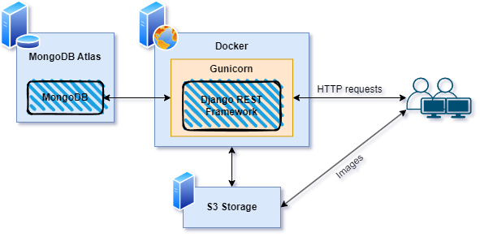

## Simple Bookstore

The Bookstore API is made according to [specifications](README.specs.md).


## Setting up and running locally

*Usage of virtualenv is recomended*
```sh
python -m venv venv
./venv/bin/activate
```

Create the `.env` file from `.env.example` template.

Install dependencies, Initialize DB:
```sh
pip install -r ./requirements.txt
python ./manage.py migrate
```

Start the project:
```sh
python ./manage.py runserver
```

## Pack and deploy
Test the app. Tests are defined in every `test.py` files.
```sh
python ./manage.py test
```
Install `flyctl` to deploy the app to Fly.io
```sh
flyctl deploy
```
Curently live at https://challenge-ocelot--longnh.fly.dev/

### CI/CD
Github Actions is set up for testing


## API functionalities

- CRUD operations for Books
- User account creation, authentication
- Pre-signed image upload URL for Book covers
- A faster endpoint

## API specification
https://challenge-ocelot--longnh.fly.dev/swagger/

Demo: [jupyternotebook](Test_endpoints.ipynb)

## System diagram

